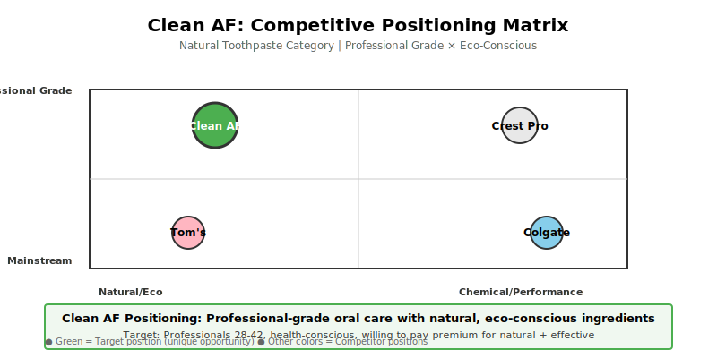

# Clean AF: Toothpaste Brand Strategy

## Overview
Developed a brand strategy for a fictional natural toothpaste brand positioned as professional-grade, eco-conscious, and effective.

## Problem Statement
The natural toothpaste category has competitors, but few brands successfully bridge "natural ingredients" with "clinical effectiveness." How should a new entrant position itself?

## My Role & Contributions
- Conducted category and competitor analysis
- Developed brand positioning statement and pillars
- Created target segment profiles
- Built marketing mix recommendations (product, price, promotion, place)
- Developed brand messaging and communication strategy

## Process & Approach
- Researched toothpaste category trends and consumer preferences
- Analyzed 5+ competitor brands (positioning, pricing, messaging)
- Created consumer segmentation and identified primary target
- Developed positioning map and brand pillars
- Built campaign concept and messaging framework

## Tools Used
- Google Sheets (market analysis)
- Canva (positioning visuals)
- PowerPoint (strategy presentation)

## Key Outputs
- Brand positioning statement and three core pillars
- Target segment profiles and behavior insights
- Competitive positioning matrix
- Marketing mix strategy (product, price, promotions, distribution)
- Campaign concept and messaging guidelines

## Skills Demonstrated
- Market research and competitive analysis
- Consumer segmentation
- Brand positioning and strategy
- Marketing mix planning
- Strategic communication

## Outcomes & Impact
- **Competitor Analysis**: Analyzed 5+ brands across positioning, pricing, messaging, and target audience
- **Market Research**: Researched category trends, consumer preferences, and emerging opportunities
- **Segment Profiles**: Created detailed primary and secondary consumer personas with behavior insights
- **Positioning Matrix**: Developed competitive positioning map revealing blue ocean opportunity vs. mass-market brands
- **Campaign Concept**: Built campaign concept with messaging framework and visual positioning guidelines
- **Deliverables**: Completed positioning statement, brand pillars, marketing mix strategy, and campaign brief

## Learnings
This project demonstrated how brand strategy synthesizes market research, consumer insights, and competitive positioning into a coherent narrative. Learned that successful positioning requires depth in category understanding, not generic messaging—specificity and consumer empathy drive distinctiveness.
